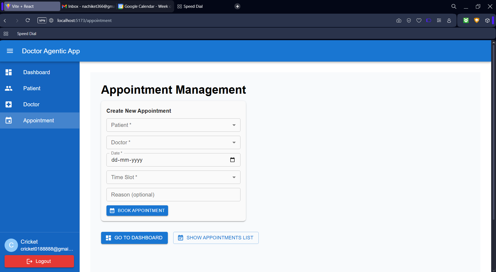
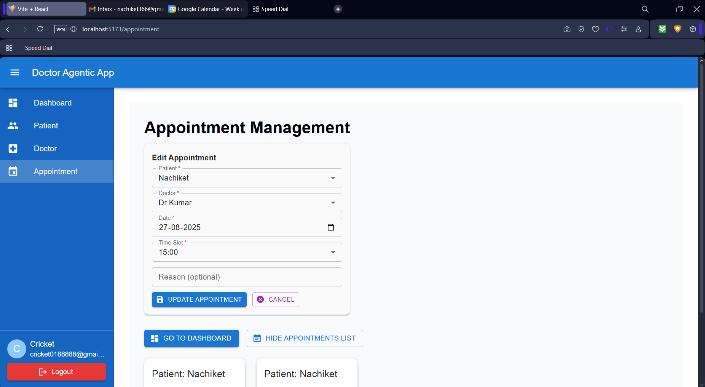
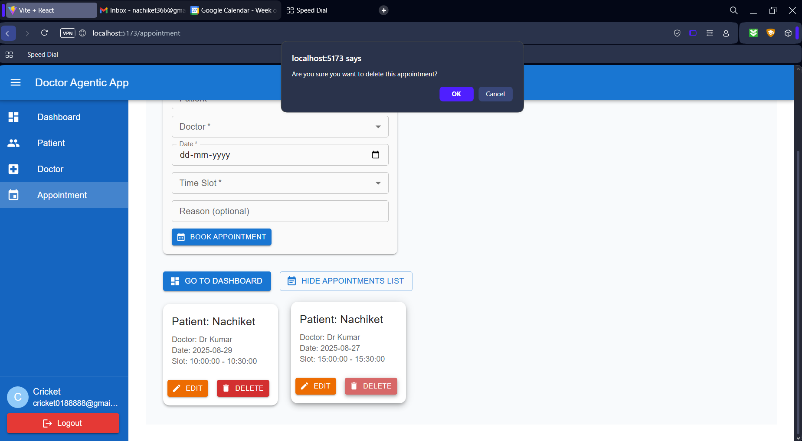
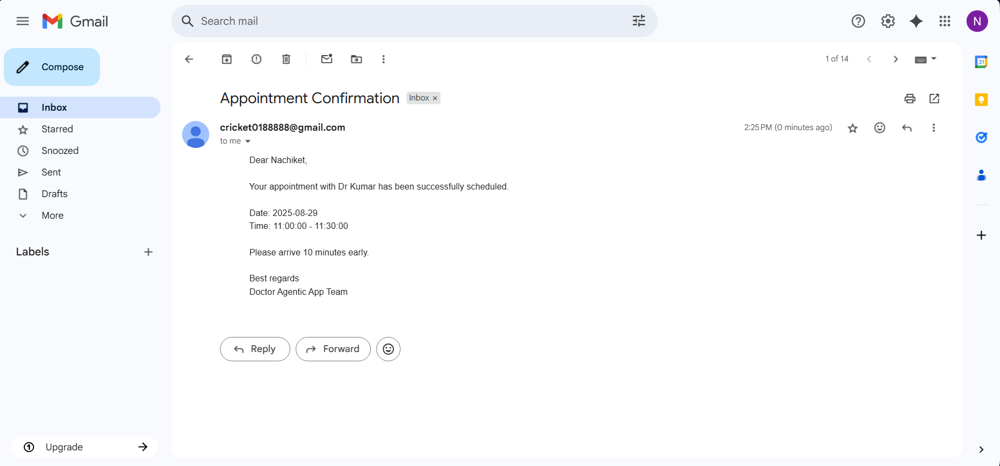

# Doctor Agentic App


---

## Overview

The **Doctor Agentic App** is a full-stack application for doctor appointment scheduling. The backend is built with **FastAPI** and uses **PostgreSQL** for data storage. The frontend is developed with **React** and styled using **TailwindCSS**. The app helps manage doctor availability, schedule appointments, and send notifications via **Google Calendar** and **Gmail APIs**.

---

## Features

- 🗓️ Create, update, and delete doctor appointments  
- 📧 Receive Gmail notifications for booked/cancelled slots  
- 📆 Sync appointments with Google Calendar  
- 👩‍⚕️ Manage doctor availability and schedules  
- 🔑 Role-based access control (Admin, Doctor, Patient)  
- 🔒 Secure authentication with OAuth2 login  
- ⚡ Built with FastAPI backend and React frontend for speed  

---

## 🎥 Demo (Videos & Screenshots)

### Create Appointment Video  
[](demo_assets/create_appointment/create_appointment.mp4)

---
### Update Appointment Video  
[](demo_assets/update_appointment/update_appointment.mp4)

---
### Delete Appointment Video  
[](demo_assets/delete_appointment/delete_appointment.mp4)

---
### Gmail Notification  


---
### Google Calendar Notification  


---

## 🛠️ Tech Stack

- **Backend**: Python ,FastAPI, SQLAlchemy 
- **Frontend**: React, TailwindCSS
- **Database**: PostgreSQL
- **Model Context Protocol (MCP)**: FastMCP
- **LLM**: Ollama (Locally hosted)
- **Other**: Pydantic, Requests, Google APIs (Calendar, Gmail)

---

## 📥 Installation

### 1. Clone the repository

```bash
git clone https://github.com/Nachiket-2024/doctor_agentic_app.git
cd doctor_agentic_app
```

### 2. Set up the environment

Install Backend dependencies with pip:

```bash
pip install -r requirements.txt
```

Install Frontend dependencies:

```bash
cd frontend
npm install
```
---

## ⚙️ Environment Variables

All environment variables are defined in `.env.example`.
It includes database URL, Google API credentials, and app-specific settings.
Copy it to `.env` and update the values with your own credentials:

```bash
cp .env.example .env
```
---

## 🚀 Run the App

> Make sure PostgreSQL is running and the database exists before running the backend.
> Google APIs (Calendar & Gmail) require valid OAuth2 credentials.  
> Configure your Google Cloud project and enable the respective APIs before use. 

### 1. Start the FastAPI backend

```bash
uvicorn backend.main:app --reload
```

### 2. Run the React frontend

```bash
cd frontend
npm run dev
```
Once both services are running:
- Frontend: [http://localhost:5173](http://localhost:5173)  
- Backend: [http://localhost:8000/docs](http://localhost:8000/docs)

---

## 🛡️ Role-Based Access Control (RBAC)

The system enforces strict role-based access control.  
Below is the full permission matrix across all roles and resources:

| **Resource**     | **Action**              | **Admin** | **Doctor**                          | **Patient**                         |
|------------------|-------------------------|-----------|-------------------------------------|-------------------------------------|
| **Patients**     | Create Patient          | ✅        | ❌                                 | ✅ (self, default on signup)        |
|                  | Get All Patients        | ✅        | ❌                                 | ❌                                  |
|                  | Get Patient By ID       | ✅        | ❌                                 | ✅ (self only)                      |
|                  | Update Patient          | ✅        | ❌                                 | ✅ (self only)                      |
|                  | Delete Patient          | ✅        | ❌                                 | ❌                                  |
| **Doctors**      | Create Doctor           | ✅        | ❌                                 | ❌                                  |
|                  | Get All Doctors         | ✅        | ✅                                 | ✅                                  |
|                  | Get Doctor By ID        | ✅        | ✅ (self only)                     | ✅                                  |
|                  | Update Doctor           | ✅        | ✅ (self only)                     | ❌                                  |
|                  | Delete Doctor           | ✅        | ❌                                 | ❌                                  |
| **Appointments** | Create Appointment      | ✅        | ❌                                 | ✅ (book with doctor)               |
|                  | Get All Appointments    | ✅        | ✅ (only their assigned patients)  | ✅ (self only)                      |
|                  | Get Appointment By ID   | ✅        | ✅ (if assigned doctor)            | ✅ (self only)                      |
|                  | Update Appointment      | ✅        | ✅ (status/notes only)             | ✅ (reschedule/cancel self)         |
|                  | Delete Appointment      | ✅        | ❌                                 | ✅ (cancel own)                     |

---

## 📝 Notes
- **Default role** → New users are always registered as **Patients**.  
- **Admin** → Has full access to all resources and actions.  
- **Doctor** → Restricted to their own profile and appointments assigned to them.  
- **Patient** → Restricted to their own profile and appointments they booked.  
- **Appointments**:  
  - Patients can reschedule or cancel their own.  
  - Doctors can update notes/status for assigned appointments.  
  - Admins can modify or delete any appointment.  

---

## 📄 License
This project is licensed under the MIT License - see the [LICENSE](LICENSE) file for details.

---
